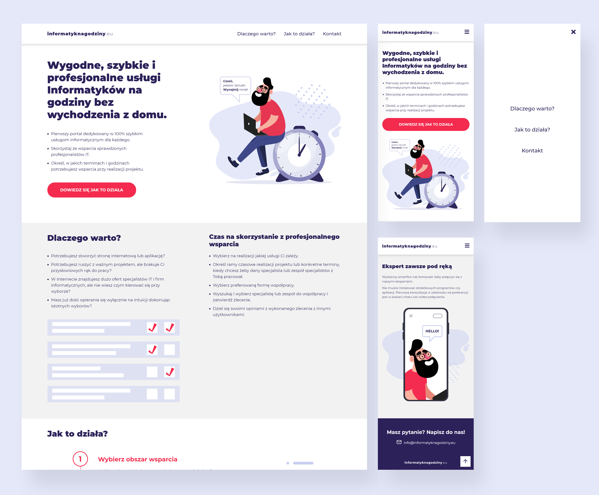

# Informatyk Na Godziny - Landing Page

This is a landing page made in React JS and styled with Sass. Design is created by me using Adobe Illustrator. I used Figma to prepare svgs for animation.

View Live Site: [https://informatyk-na-godziny.netlify.app/](https://informatyk-na-godziny.netlify.app/)

#

### Built with:

#### Design:

- Adobe Illustrator
- Figma

#### Code:

- [ReactJS](https://reactjs.org/) - JavaScript library for building user interfaces
- [SASS](https://sass-lang.com/) - Superpower CSS extension
- [React Scroll](https://www.npmjs.com/package/react-scroll)
- [React Icons](https://react-icons.github.io/react-icons/)
- Semantic HTML5 markup
- [BEM Methodology](http://getbem.com/)
- Mobile-first workflow
- Flexbox
- SVG Animation
